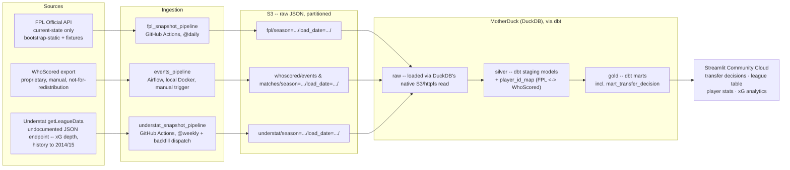

# FPL Data Platform

[](https://github.com/liban-osman/premier-league/actions/workflows/ci.yml)

A data platform for Fantasy Premier League: three sources snapshotted and landed on a
schedule, modelled raw → silver → gold with dbt on MotherDuck, and served as a live
"transfer in / drop" decision app.

**[▶ Live app](https://fantasyprem.streamlit.app)** — Streamlit Community Cloud,
auto-redeploys on every push to `main`.



## Why this exists

The official FPL API only exposes the **current** state of the game — today's prices,
form, ownership, injury flags — and throws history away. But every question a manager
actually has is a question about *change*: who's rising, whose price is about to move,
whose form is a streak versus a trend. None of that is answerable from a single API call.

So this platform **snapshots the API on a schedule and builds the time series that
doesn't otherwise exist**, enriches it with proprietary per-match event data (WhoScored)
and a second xG model (Understat), and reduces it all to one number per player per day:
a 0–100 `transfer_score` with an explicit, tunable weighting — 30% value, 25% form,
20% underlying threat (Understat npxG+xA per 90), 15% fixture ease, 10% transfer
momentum, with availability as a hard gate rather than a weighted input.

A missed day of snapshots is unrecoverable history, which is why ingestion runs
unattended on GitHub Actions cron rather than anything that needs a machine switched on.

## The numbers

| What | Count |
|---|---|
| Data sources | 3 (FPL API · WhoScored export · Understat) |
| Live schedulers | 2 GitHub Actions crons — FPL daily 06:00 UTC, Understat weekly Mon 06:30 UTC |
| dbt models | 19 (10 staging · 2 cross-source id maps · 7 marts) |
| Tests | 57 dbt data tests + 9 pytest, all on every push (CI ~15s) |
| WhoScored match events staged | 579,441 across 380 matches (full 2024/25 season) |
| Understat rows staged | 1,099 player-seasons · 1,520 team-match records across 2 seasons |
| Players scored daily | 841, one `transfer_score` each per snapshot |
| Cross-source player mapping | 585 FPL↔Understat (96% of current-season players; 100% of those with 900+ minutes) · 470 FPL↔WhoScored — deterministic rules + a hand-verified override seed, zero fuzzy matching |
| Manual steps in the live pipeline | 0 |

Quality is enforced as invariants, not spot checks: goal events parsed from the
WhoScored event stream must equal goals parsed from its scorelines (1,115 = 1,115),
and both must reconcile with Understat's independent count for the same season —
three sources agreeing before any of them feeds a mart.

## Stack

- **Ingestion** — Python (`requests`), S3-first landing as hive-partitioned raw JSON
  (`season=.../load_date=.../`), loaded into MotherDuck with DuckDB's native
  `read_json_auto` over httpfs. No copy steps, no glue services.
- **Warehouse + transform** — DuckDB/MotherDuck with **dbt-core**: `raw` → `silver`
  (typed, unnested staging views + mapping tables) → `gold` (marts).
- **Orchestration** — GitHub Actions cron runs the live pipelines; an **Airflow** DAG
  (local Docker, `LocalExecutor`) drives the manual WhoScored loads and stays in the
  repo as a working artifact.
- **Consumption** — Streamlit Community Cloud, four pages over gold/silver.
- **CI** — ruff (lint + format) and pytest on every push and PR.

Design-first: the architecture diagram and a numbered decision log predate the code and
record every choice — including the ones that were reversed (Snowflake → MotherDuck) —
in [docs/architecture.md](docs/architecture.md) and
[docs/decision_log.md](docs/decision_log.md).

## Repo tour

```
scripts/          ingestion: fpl_snapshot, understat_snapshot, S3 uploads, load_raw
dbt/              models/staging · models/mapping · models/marts, tests/, schema yml
app/              Streamlit pages (transfer decisions · league table · player stats · xG)
airflow_dag/      events_pipeline DAG (WhoScored, manual trigger)
tests/            pytest suite for the ingestion scripts
docs/             architecture diagram + decision log
.github/workflows ci · fpl_snapshot (daily) · understat_snapshot (weekly)
```

## Running it

The live system needs nothing from you — the crons run and the app redeploys itself.
To run locally:

```bash
uv sync                                  # locked env, same as CI
cp .env.example .env                     # BUCKET, AWS creds, MOTHERDUCK_TOKEN
python scripts/fpl_snapshot.py           # fetch + land today's snapshot in S3
python scripts/load_raw.py fpl_bootstrap # S3 -> MotherDuck raw
python scripts/load_raw.py fpl_fixtures
cd dbt && dbt build --profiles-dir .     # raw -> silver -> gold, with tests
streamlit run app/streamlit_app.py
```

The Airflow path (WhoScored events) runs in Docker: `docker-compose up`, trigger
`events_pipeline` in the UI at `localhost:8080`.

## Data & licensing

The WhoScored per-match event data is **not for redistribution**: raw files never enter
this repo (enforced via `.gitignore` + `.env`), and the public app only ever renders
season-level aggregates, never events. Team badges and player photos are hotlinked from
the official Premier League CDN, not stored. Understat data is attributed on-page.
