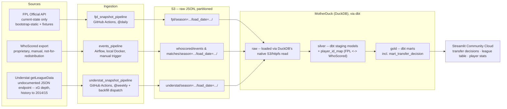

# Architecture

FPL Data Platform — snapshots two sources on a schedule, lands them in DuckDB/MotherDuck through a
raw → silver → gold layering (via dbt), and serves a decision layer + visualizations off the top.

> Revised from the original Snowflake-based design in [decision_log.md](decision_log.md) — cost
> (Snowflake trial credits expire) and needing an actually-deployed, actually-free site drove the
> swap to DuckDB/MotherDuck + dbt + Streamlit Community Cloud.

## Stage notes

**Sources.** Unchanged from the original design: FPL is a public, current-state-only API;
WhoScored is a proprietary per-match event export, manual today, never committed to the repo.

**Ingestion.** Two separate schedulers, not one, because the two sources have genuinely
different automation stories:

- `fpl_snapshot_pipeline` — runs on **GitHub Actions cron**, `@daily` at 06:00 UTC
  (`.github/workflows/fpl_snapshot.yml`): fetch FPL `bootstrap-static` **and `fixtures`** →
  land both in S3 → load MotherDuck `raw` (`fpl_bootstrap`, `fpl_fixtures`) → `dbt build`.
  GitHub Actions instead of Airflow here because there's no free way to keep an Airflow
  scheduler running unattended 24/7 for a personal project, and Actions is free for a public
  repo. `BUCKET`, `AWS_*`, and `MOTHERDUCK_TOKEN` live as **GitHub repo secrets** (configured,
  live, and green as of 2026-07-10).
- `understat_snapshot_pipeline` — **GitHub Actions cron, `@weekly`** (Mondays, after the
  weekend round), plus `workflow_dispatch` with a seasons input for historical backfill.
  Weekly, not daily, and a separate workflow from the FPL snapshot on purpose: Understat
  serves full history on demand (no snapshot urgency — see decision log #26), and a scrape
  failure against an undocumented endpoint must never take down the live daily FPL pipeline.
  One `GET /getLeagueData/EPL/{season}` per season; the payload splits into three
  top-level-array JSON files (`players` / `matches` / `teams`) before landing (#27).
- `events_pipeline` — stays on **Airflow, local Docker, LocalExecutor**, manually triggered.
  This DAG already exists (`airflow_dag/pipeline_dag.py`) and is kept specifically as a
  demonstrated artifact of Airflow fluency, even though it isn't the thing actually running the
  live site. Its `load_raw` task now calls the same `scripts/load_raw.py` helper the GitHub
  Actions workflow uses, for the WhoScored sources.

**Landing (S3).** Unchanged — raw JSON, partitioned by season and load date.

**Warehouse + transform (MotherDuck via dbt).** Replaces Snowflake + plain SQL scripts.
- `raw` — loaded via DuckDB's native `read_json_auto('s3://...')` / httpfs support, no separate
  `COPY INTO` step needed the way Snowflake required.
- `silver` = dbt **staging** models (views) — cleaned, typed: `stg_fpl_players` / `teams` /
  `positions` (unnested from bootstrap), `stg_fpl_fixtures`, and the WhoScored side:
  `stg_whoscored_matches` / `events` / `players`, all read off the match-centre payload in
  `raw.whoscored_events` (one row per match; the calendar export carries nothing extra and
  stays unstaged); and the Understat side: `stg_understat_players` / `matches` /
  `team_matches`, which read **only the latest load_date per season** (refresh semantics —
  decision log #26). Silver also holds the **mapping** models, materialized as tables:
  `player_id_map` (FPL ↔ WhoScored) and `player_id_map_understat` (FPL ↔ Understat) — the
  explicit cross-source join keys, each a ladder of deterministic exact name-match rules
  (no fuzzy matching; 1:1 enforced by tests). See decision log #21–24 and #28.
- `gold` = dbt **marts** models (tables):
  - five signal marts — form trend, price momentum, team fixture difficulty (rolling next-5
    FDR), value (points per £m ranked in position), availability risk;
  - `mart_transfer_decision` — the decision layer: each signal becomes a `percent_rank`
    within (load_date, position), weighted 35/30/20/15 into a 0–100 `transfer_score`,
    with availability as a hard gate (high-risk → drop) rather than a weighted input;
  - `mart_league_table` — standings derived from finished fixture results (FPL zeroes the
    bootstrap team records in preseason snapshots), guarded by a goals-balance invariant test.
- dbt vocabulary maps directly onto the raw/silver/gold naming used everywhere else in this
  project; see the comment in `dbt/dbt_project.yml`.
- dbt runs from its **own isolated venv** inside the Airflow image (`/home/airflow/dbt-venv`),
  not Airflow's own Python environment — dbt-core's dependencies genuinely conflict with
  Airflow's pinned constraints (hit this for real: `isodate` version conflict), so they can't
  share a site-packages directory.

**Consumption.** Streamlit, deployed on **Streamlit Community Cloud** (free, public-repo tier)
instead of local-only `streamlit run` — the actual fix for "usable by someone who isn't me."
Connects to the same MotherDuck database the pipeline writes to, via `MOTHERDUCK_TOKEN`
(bridged from `st.secrets` into the environment on Cloud; from `.env` locally). Auto-redeploys
on every push to `main`. Three pages behind `st.navigation`:

- **Transfer decisions** — the headline view over `mart_transfer_decision`, filterable by
  position and recommendation.
- **League table** — reads `mart_league_table`.
- **Player stats** — top scorers/assists leaderboards and a goals-vs-xG scatter; reads
  `silver` directly, deliberately: these are pure projections with no business logic, and a
  pass-through mart would add a copy, not value.

**WhoScored on the public app: heavy aggregates only.** The data is not-for-redistribution and
a public app is redistribution — so raw events or per-match detail never render there (the old
pass-map page was removed for this reason, among others). Season-level derived metrics are the
permitted ceiling.

## Known open items

- ~~**FPL ↔ WhoScored join key.**~~ Resolved 2026-07-11 for players: `player_id_map` maps
  433 of 685 WhoScored players to FPL ids via deterministic name-match rules (decision log
  #23; the unmatched rest are largely players with no 2025/26 FPL counterpart). Team-grain
  mapping stays deferred until a mart needs it.
- ~~**WhoScored staging models don't exist yet.**~~ Resolved 2026-07-11:
  `stg_whoscored_matches` / `events` / `players` are live, with an internal-consistency
  test (goal events = ftScore goals). Note the export is the **2024/25** season — one season
  behind the FPL snapshots — so cross-source joins are cross-season until a 2025/26 export
  is uploaded.
- ~~**Understat is reserved, not wired.**~~ Resolved 2026-07-11: `understat_snapshot.py` +
  weekly workflow land seasons 2024 and 2025; staging (`stg_understat_players` / `matches` /
  `team_matches`) reads the latest load_date per season; `player_id_map_understat` joins to
  FPL. Consumption (xG league pages, decision-layer enrichment) is the follow-up step.
- ~~**`SEASON` pinned to `"2025"`**~~ Resolved 2026-07-10: `fpl_snapshot.py` derives the
  season from the API payload (first gameweek deadline year), so the partition label rolls
  over automatically on flip day. `SEASON` env var remains as a manual-backfill override and
  still labels the WhoScored upload scripts.
- **Unused app dependencies.** `mplsoccer` / `matplotlib` remain in `pyproject.toml` after the
  pass-map page was removed; dropping them requires regenerating `uv.lock`, and `uv` isn't
  installed on the dev machine. Cleanup deferred, deliberately, to avoid breaking the
  workflow's `uv sync --locked`.
