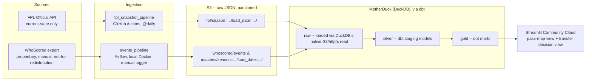

# Architecture

FPL Data Platform — snapshots two sources on a schedule, lands them in DuckDB/MotherDuck through a
raw → silver → gold layering (via dbt), and serves a decision layer + visualizations off the top.

> Revised from the original Snowflake-based design in [decision_log.md](decision_log.md) — cost
> (Snowflake trial credits expire) and needing an actually-deployed, actually-free site drove the
> swap to DuckDB/MotherDuck + dbt + Streamlit Community Cloud.

## Stage notes

**Sources.** Unchanged from the original design: FPL is a public, current-state-only API;
WhoScored is a proprietary per-match event export, manual today, never committed to the repo.

**Ingestion.** Two separate schedulers, not one, because the two sources have genuinely
different automation stories:

- `fpl_snapshot_pipeline` — runs on **GitHub Actions cron**, `@daily`
  (`.github/workflows/fpl_snapshot.yml`): fetch FPL `bootstrap-static` → land in S3 → load
  MotherDuck `raw` → `dbt build`. GitHub Actions instead of Airflow here because there's no free
  way to keep an Airflow scheduler running unattended 24/7 for a personal project, and Actions
  is free for a public repo. Needs `BUCKET`, `AWS_ACCESS_KEY_ID`, `AWS_SECRET_ACCESS_KEY`,
  `AWS_DEFAULT_REGION`, `MOTHERDUCK_TOKEN` configured as **GitHub repo secrets** before it can
  actually run — that's a manual step in the repo's own Settings, not something committable.
- `events_pipeline` — stays on **Airflow, local Docker, LocalExecutor**, manually triggered.
  This DAG already exists (`airflow_dag/pipeline_dag.py`) and is kept specifically as a
  demonstrated artifact of Airflow fluency, even though it isn't the thing actually running the
  live site. Its `load_raw` task now calls the same `scripts/load_raw.py` helper the GitHub
  Actions workflow uses, for the WhoScored sources.

**Landing (S3).** Unchanged — raw JSON, partitioned by season and load date.

**Warehouse + transform (MotherDuck via dbt).** Replaces Snowflake + plain SQL scripts.
- `raw` — loaded via DuckDB's native `read_json_auto('s3://...')` / httpfs support, no separate
  `COPY INTO` step needed the way Snowflake required.
- `silver` = dbt **staging** models (views) — cleaned, typed.
- `gold` = dbt **marts** models (tables) — form trend, price momentum, fixture difficulty,
  value, availability risk (FPL side); `fact_pass_events` and similar (events side).
- dbt vocabulary maps directly onto the raw/silver/gold naming used everywhere else in this
  project; see the comment in `dbt/dbt_project.yml`.
- dbt runs from its **own isolated venv** inside the Airflow image (`/home/airflow/dbt-venv`),
  not Airflow's own Python environment — dbt-core's dependencies genuinely conflict with
  Airflow's pinned constraints (hit this for real: `isodate` version conflict), so they can't
  share a site-packages directory.

**Consumption.** Streamlit, deployed on **Streamlit Community Cloud** (free, public-repo tier)
instead of local-only `streamlit run` — the actual fix for "usable by someone who isn't me."
Connects to the same MotherDuck database Airflow writes to, over the network, via
`MOTHERDUCK_TOKEN`.

## Known open items

- **FPL ↔ WhoScored join key.** Still unresolved, still deferred to Phase 4 — no natural shared
  player/team identifier between the two sources.
- **No dbt models exist yet.** `raw` loading is real and working; `dbt/models/staging` and
  `dbt/models/marts` are still empty beyond `sources.yml`. `dbt build` runs successfully against
  zero models — it just does nothing yet. Writing the actual staging/marts SQL is Phase 4.
- **Not live-tested against real AWS/MotherDuck credentials.** `load_raw.py`'s S3 → MotherDuck
  path (the `CREATE SECRET` + `read_json_auto` call) is written correctly but unverified beyond
  local config validation — nobody has run it with a real bucket + token yet.
- **GitHub Actions secrets aren't configured.** The workflow file is real; the repo secrets it
  reads (`BUCKET`, `AWS_*`, `MOTHERDUCK_TOKEN`) still need to be added in GitHub's Settings.
- **Streamlit Cloud deployment is a manual step.** Needs the repo owner's own GitHub login at
  share.streamlit.io — not something that can be scripted from here.
