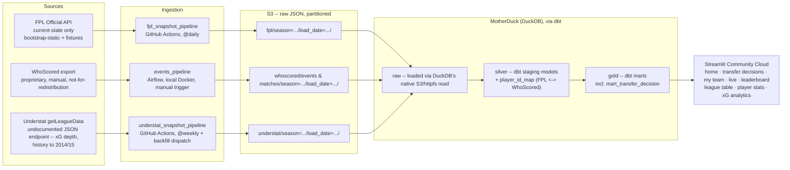

# Architecture

FPL Data Platform — snapshots two sources on a schedule, lands them in DuckDB/MotherDuck through a
raw → silver → gold layering (via dbt), and serves a decision layer + visualizations off the top.

> Revised from the original Snowflake-based design in [decision_log.md](decision_log.md) — cost
> (Snowflake trial credits expire) and needing an actually-deployed, actually-free site drove the
> swap to DuckDB/MotherDuck + dbt + Streamlit Community Cloud.

## Stage notes

**Sources.** Unchanged from the original design: FPL is a public, current-state-only API;
WhoScored is a proprietary per-match event export, manual today, never committed to the repo.

**Ingestion.** Two separate schedulers, not one, because the two sources have genuinely
different automation stories:

- `fpl_snapshot_pipeline` — runs on **GitHub Actions cron**, `@daily` at 06:00 UTC
  (`.github/workflows/fpl_snapshot.yml`): fetch FPL `bootstrap-static` **and `fixtures`** →
  land both in S3 → load MotherDuck `raw` (`fpl_bootstrap`, `fpl_fixtures`) → `dbt build`.
  GitHub Actions instead of Airflow here because there's no free way to keep an Airflow
  scheduler running unattended 24/7 for a personal project, and Actions is free for a public
  repo. `BUCKET`, `AWS_*`, and `MOTHERDUCK_TOKEN` live as **GitHub repo secrets** (configured,
  live, and green as of 2026-07-10). If any step fails, a final `if: failure()` step opens
  (or comments on an already-open) GitHub issue labeled `pipeline-failure` — a red run went
  unnoticed for two days in production before a manual check caught it (decision log,
  2026-07-21), so the run now surfaces its own failures instead of waiting to be found.
- `understat_snapshot_pipeline` — **GitHub Actions cron, `@weekly`** (Mondays, after the
  weekend round), plus `workflow_dispatch` with a seasons input for historical backfill.
  Weekly, not daily, and a separate workflow from the FPL snapshot on purpose: Understat
  serves full history on demand (no snapshot urgency — see decision log #26), and a scrape
  failure against an undocumented endpoint must never take down the live daily FPL pipeline.
  One `GET /getLeagueData/EPL/{season}` per season; the payload splits into three
  top-level-array JSON files (`players` / `matches` / `teams`) before landing (#27).
- `events_pipeline` — stays on **Airflow, local Docker, LocalExecutor**, manually triggered.
  This DAG already exists (`airflow_dag/pipeline_dag.py`) and is kept specifically as a
  demonstrated artifact of Airflow fluency, even though it isn't the thing actually running the
  live site. Its `load_raw` task now calls the same `scripts/load_raw.py` helper the GitHub
  Actions workflow uses, for the WhoScored sources.

**Landing (S3).** Unchanged — raw JSON, partitioned by season and load date.

**Warehouse + transform (MotherDuck via dbt).** Replaces Snowflake + plain SQL scripts.
- `raw` — loaded via DuckDB's native `read_json_auto('s3://...')` / httpfs support, no separate
  `COPY INTO` step needed the way Snowflake required.
- `silver` = dbt **staging** models (views) — cleaned, typed: `stg_fpl_players` / `teams` /
  `positions` (unnested from bootstrap), `stg_fpl_fixtures`, and the WhoScored side:
  `stg_whoscored_matches` / `events` / `players`, all read off the match-centre payload in
  `raw.whoscored_events` (one row per match; the calendar export carries nothing extra and
  stays unstaged); and the Understat side: `stg_understat_players` / `matches` /
  `team_matches`, which read **only the latest load_date per season** (refresh semantics —
  decision log #26). Silver also holds the **mapping** models, materialized as tables:
  `player_id_map` (FPL ↔ WhoScored) and `player_id_map_understat` (FPL ↔ Understat) — the
  explicit cross-source join keys, each a ladder of deterministic exact name-match rules
  (no fuzzy matching; 1:1 enforced by tests). See decision log #21–24 and #28.
- `gold` = dbt **marts** models (tables):
  - five signal marts — form trend, price momentum, team fixture difficulty (rolling next-5
    FDR), value (points per £m ranked in position), availability risk;
  - `mart_transfer_decision` — the decision layer: each signal becomes a `percent_rank`
    within (load_date, position), weighted 30/25/20/15/10 (value / form / Understat
    underlying threat / fixtures / momentum) into a 0–100 `transfer_score`, with
    availability as a hard gate (high-risk → drop) rather than a weighted input;
  - `mart_league_table` — standings derived from finished fixture results (FPL zeroes the
    bootstrap team records in preseason snapshots), guarded by a goals-balance invariant test;
  - `mart_team_defensive_outlook` — a 0–100 `defensive_outlook_score` per team, blending
    clean-sheet rate so far this season (60%) with upcoming fixture ease (40%), built for
    goalkeeper/defender decisions that `mart_transfer_decision`'s own signals barely speak to.
- dbt vocabulary maps directly onto the raw/silver/gold naming used everywhere else in this
  project; see the comment in `dbt/dbt_project.yml`.
- dbt runs from its **own isolated venv** inside the Airflow image (`/home/airflow/dbt-venv`),
  not Airflow's own Python environment — dbt-core's dependencies genuinely conflict with
  Airflow's pinned constraints (hit this for real: `isodate` version conflict), so they can't
  share a site-packages directory.

**Consumption.** Streamlit, deployed on **Streamlit Community Cloud** (free, public-repo tier)
instead of local-only `streamlit run` — the actual fix for "usable by someone who isn't me."
Connects to the same MotherDuck database the pipeline writes to, via `MOTHERDUCK_TOKEN`
(bridged from `st.secrets` into the environment on Cloud; from `.env` locally). Auto-redeploys
on every push to `main`. Eight pages behind `st.navigation`:

- **Home** (default landing page) — a guided entry point rather than dropping a first-time
  visitor straight into a data page: a one-paragraph pitch, four "today's highlights" cards
  pulled from four different marts (top transfer pick, biggest xG performance story, best
  clean-sheet bet, league leader) each linking into the page that explains it, then a
  `st.page_link` row into every other page with a one-line description of what it's for.
- **Transfer decisions** — the headline view over `mart_transfer_decision`, led by five
  actionable-highlight sections: **movers since last snapshot** (high-ownership players whose
  recommendation bucket flipped day-over-day, split into consider-selling / consider-buying),
  **budget picks** (best `transfer_score` under a user-set price cutoff, split into a column
  per position so all four show at once rather than needing a filter), **differentials**
  (high score, low ownership, for climbing rank rather than tracking the template), **clean
  sheet picks** (top goalkeeper/defender holds by `mart_team_defensive_outlook`), and
  **captain this gameweek** (top scores paired with each player's next fixture specifically,
  not the rolling next-5), then top pick per position. The full sortable/filterable table and
  detailed methodology are demoted into a collapsed section, with a click-a-row card showing
  the five weighted signals behind the score.
- **My Team** — the only page that calls the live FPL API directly rather than reading from
  MotherDuck: given a manager's public team ID, fetches their current picks
  (`entry/{id}/event/{gw}/picks/`, no auth required) and joins them against
  `mart_transfer_decision` on `player_id` (FPL's own `element` id — no mapping needed, it's
  the same id our own `player_id` column already is). Shows squad value/bank, flags
  drop/monitor players with a same-position affordable replacement suggestion, and compares
  the manager's actual captain against the highest-scoring fit starter in their XI. No new
  ingestion or dbt models — the picks are per-manager and change within a day (transfers,
  chip use), which is the opposite of what the daily snapshot pattern is for.
- **Live** — the other live-API page: pulls `event/{gw}/live/` for the current gameweek's
  provisional stats (goals, assists, bonus, total points as BPS awards them) and shows the
  top 15 performers so far, plus the gameweek's average/highest score once FPL computes
  them. Same off-season detection as My Team (an already-finished gameweek with no next one
  queued), reused rather than re-derived.
- **Leaderboard** — the third live-API page: given a manager's team ID, lists their
  private classic mini-leagues (`entry/{id}/`'s `leagues.classic`, filtered to
  `league_type == "x"` — user-created leagues, not the automatic system ones like
  "Overall" or a supported club's league, which are too large to be a meaningful table)
  and shows the standings for whichever one is picked
  (`leagues-classic/{league_id}/standings/`), with the manager's own row flagged. First
  page only (top 50) — no pagination into further pages yet.
- **League table** — reads `mart_league_table`: badges, last-5 form guide, and
  qualification/relegation zone tints.
- **Player stats** — top scorers/assists leaderboards and a goals-vs-xG scatter with
  click-a-point player cards; reads `silver` directly, deliberately: these are pure
  projections with no business logic, and a pass-through mart would add a copy, not value.

Team badges and player photos hotlink the official Premier League asset CDN, keyed on the
stable asset codes staged in `stg_fpl_teams` / `stg_fpl_players` (decision log #29) —
nothing is stored in the repo.
- **xG analytics** — Understat-powered, season-selectable (2024/25 and 2025/26): team xG
  table with xPTS and PPDA, points-vs-xPTS scatter, finishing over/under-performance, and a
  defensive mirror (xGA minus goals conceded) for the same over/under-performance read on
  defense. Same silver-read policy; attributes the xG model to Understat on-page.

**WhoScored on the public app: heavy aggregates only.** The data is not-for-redistribution and
a public app is redistribution — so raw events or per-match detail never render there (the old
pass-map page was removed for this reason, among others). Season-level derived metrics are the
permitted ceiling.

**Visual design.** `.streamlit/config.toml` sets a dark, violet-accented theme built from the
same validated reference palette `app/ui.py` already used for chart series (decision log
#52-56) — applied one layer up, at the app-chrome level, instead of only inside chart marks.
`app/ui.py` also carries the color *meaning*: a fixed status palette (transfer_in/hold/monitor/drop
→ green/blue/yellow/red) and a fixed position palette (GKP/DEF/MID/FWD → violet/aqua/orange/magenta),
rendered as a card's colored left border (keyed via `st.container`'s `key` param) or a translucent
row wash (`df.style.apply()`, the same technique `league_table.py`'s `zone_tint` established) —
never the sole channel; icon + label carries the same information alongside every color.

## Known open items

- ~~**FPL ↔ WhoScored join key.**~~ Resolved 2026-07-11 for players: `player_id_map` maps
  433 of 685 WhoScored players to FPL ids via deterministic name-match rules (decision log
  #23; the unmatched rest are largely players with no 2025/26 FPL counterpart). Team-grain
  mapping stays deferred until a mart needs it.
- ~~**WhoScored staging models don't exist yet.**~~ Resolved 2026-07-11:
  `stg_whoscored_matches` / `events` / `players` are live, with an internal-consistency
  test (goal events = ftScore goals). Note the export is the **2024/25** season — one season
  behind the FPL snapshots — so cross-source joins are cross-season until a 2025/26 export
  is uploaded.
- ~~**Understat is reserved, not wired.**~~ Resolved 2026-07-11: `understat_snapshot.py` +
  weekly workflow land seasons 2024 and 2025; staging (`stg_understat_players` / `matches` /
  `team_matches`) reads the latest load_date per season; `player_id_map_understat` joins to
  FPL. Consumption (xG league pages, decision-layer enrichment) is the follow-up step.
- ~~**`SEASON` pinned to `"2025"`**~~ Resolved 2026-07-10: `fpl_snapshot.py` derives the
  season from the API payload (first gameweek deadline year), so the partition label rolls
  over automatically on flip day. `SEASON` env var remains as a manual-backfill override and
  still labels the WhoScored upload scripts.
- ~~**Unused app dependencies.**~~ Resolved 2026-07-11: `uv` installed locally, `mplsoccer` /
  `matplotlib` dropped from `pyproject.toml`, and `uv.lock` regenerated (purely subtractive —
  10 packages removed, no version changes), keeping the workflow's `uv sync --locked` intact.
