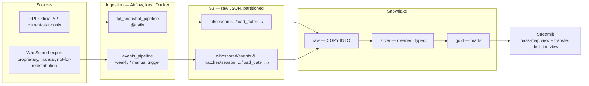

# Architecture

FPL Data Platform — snapshots two sources on a schedule, lands them in Snowflake through a
raw → silver → gold layering, and serves a decision layer + visualizations off the top.

## Stage notes

**Sources.** Two independent feeds with different shapes and different cadences: FPL is a
public API that only ever answers "what's true right now," so history only exists if we
capture it ourselves. WhoScored is a proprietary per-match event export — manual today,
never committed to the repo (raw data is gitignored; only code/schema/synthetic samples are
tracked).

**Ingestion.** Two Airflow DAGs, not one, because they run on genuinely different schedules:

- `fpl_snapshot_pipeline` — `@daily`. Calls the FPL API, writes JSON, uploads to S3, then
  triggers the Snowflake load. Fully automated, no human step.
- `events_pipeline` — weekly or manually triggered. Depends on a WhoScored export having
  already landed locally (via `events_upload.py` / `matches_upload.py`), so it can't run on
  a tighter schedule than that manual step allows.

Both write to S3 using the same partitioning convention (`season=/load_date=`) so raw-layer
loading in Snowflake is symmetric across sources even though the DAGs themselves are separate.

**Landing (S3).** Raw JSON, untouched, partitioned by season and load date. This is the
layer that makes reprocessing/backfills possible without re-hitting either source.

**Warehouse (Snowflake).** Plain SQL scripts per layer (no dbt), run via `SnowflakeOperator`
tasks:
- `raw` — `COPY INTO` from S3, minimal shaping.
- `silver` — cleaned, typed, deduplicated.
- `gold` — marts. FPL side: form trend, price momentum, fixture difficulty, value (points
  per £m), availability risk. Events side: `fact_pass_events` and similar match-event marts.

**Consumption.** Streamlit. Today: a pass-map visualizer over `gold.fact_pass_events`. Later:
the transfer in/drop decision view over the FPL gold marts — the actual point of the project.

## Known open item

FPL and WhoScored use different player identifiers with no natural shared key. Joining them
(needed for any mart that blends event data with FPL price/ownership data) will need an
explicit mapping table — deferred to Phase 4 (storage + transform) rather than solved here.
